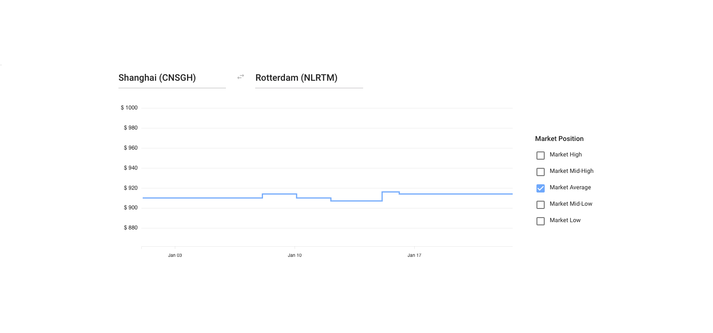

# Assignment

We ask you to implement a web page that visualizes the data returned by the [API](#api-description).

Create an interactive web page that visualizes how average, low and high prices change over time on a selected trade-lane. Our stack is based on D3, ReactJS, Redux and Webpack, but you are free to choose anything you like.

The user of the page should be able to do text search for origin and destination ports, and when those are chosen the user should see a graph that displays average, low and high market prices over time. This is how this looks in our platform:



If you think there is a different way of visualization that serves the task better, feel free do do it your own way – we only present this screenshot as an example.


# Extra details

- It usually takes 2 - 6 hours to complete this task for a developer with 2+ years of experience with React.
- Our key evaluation criteria:
    - Ease of setup and testing
    - Code clarity and simplicity
    - Comments where appropriate
    - Code organisation
    - Tests
- Keep your solution in a Version Control System of your choice. Provide the solution as a public repository that can be easily cloned by our development team.
- Provide any instructions needed to set up the system in README.md.
- If you have any questions, please don't hesitate to contact us
- Please let us know how much time you spent on the task, and of any difficulties that you ran into.

# API Description

We provide you with an API that serves a simplified subset of real-world data.

## Authorization

API is protected by an unique API key, which is sent to you along with this task specification. If you have not received your API key, do not hesitate to contact us.

To authorize with the API, send `X-Api-Key=<your-api-key>` header in the API request.

## Ports API

This API endpoint returns ports that are available in the system. Information about each port includes:

- 5-character port code
- Human-friendly port name

Example:

```
curl -H 'x-api-key: <your-api-key>' https://685rp9jkj1.execute-api.eu-west-1.amazonaws.com/prod/ocean/ports
```
```
[
    {
        "code": "CNSGH",
        "name": "Shanghai"
    },
    ...
]
```


## Market rates API

This API endpoint returns market average, low and high prices of shipping a container on certain days between two ports that are sent to the API as parameters. Please note that not all the possible port pairs have corresponding market rate data.

API parameters are:

- `origin`, `destination`: 5-character port codes, origin and destination ports respectively

Example:

```
curl -H 'x-api-key: <your-api-key>' 'https://685rp9jkj1.execute-api.eu-west-1.amazonaws.com/prod/ocean/rates?origin=CNSGH&destination=NOOSL'
```
```
[
    {
        "day": "2021-01-01",
        "mean": 500,
        "low": 100,
        "high": 800
    },
    ...
]
```